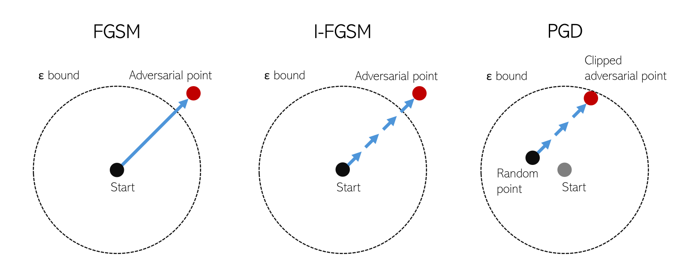

# mlff_attack

[](https://www.python.org/downloads/)
[](https://pytorch.org/)
[](LICENSE)
[](https://trustworthy-ai-tools-for-science.github.io/mlff_attack/)

Attacks against MLFF Models - A Python package for testing and analyzing Machine Learning Force Fields models through adversarial attacks.

### Attacks Implemented

| Attack Name | Paper | 
| --- | --- |
| Fast Gradient Sign Method (FGSM) | [link](https://arxiv.org/abs/1412.6572) |
| Iterative Fast Gradient Sign Method (I-FGSM) | [link](https://arxiv.org/abs/1607.02533) | 
| Projected Gradient Descent (PGD) | [link](https://arxiv.org/abs/1706.06083) |

<p align="center">
  
</p>

<p align="center">
  <em>Visual overview of the adversarial attacks.</em>
</p>

### Models Supported

| Model Name | Paper |
| --- | --- |
| Message Passing Atomic Cluster Expansion (MACE) | [link](https://arxiv.org/abs/2206.07697) |
| Multi-Head Message Passing Atomic Cluster Expansion (MACE-MH) | [link](https://arxiv.org/pdf/2510.25380) |
| Universal Model for Atoms (UMA) | [link](https://ai.meta.com/research/publications/uma-a-family-of-universal-models-for-atoms/) |

## Installation

### Install from source (development mode)

```bash
# Clone the repository
git clone https://github.com/TRustworthy-AI-Tools-for-Science/mlff_attack.git
cd mlff_attack

# Install in editable mode
pip install -e .

# Or install with development dependencies
pip install -e ".[dev]"
```

### Install MACE or UMA support

MACE and UMA should be installed in separate Python environments because their dependencies can conflict.

```bash
# MACE support
pip install -e ".[mace]"

# UMA support must be in Python <= 3.12 and requires access through Hugging Face
pip install -e ".[uma]"
hf auth login
```

## Usage

### Running calculations

After installation, you can use the `calc-single` commands for MACE, MACE-MH, or UMA calculations:

```bash
# MACE
calc-single --input <structure>.cif --model mace-<model>.model --outdir <output_directory>

# MACE-MH
calc-single --input <structure>.cif --model mace-mh-<model>.model --outdir <output_directory> --mace-head <head-name>

# UMA
calc-single --input <structure>.cif --model uma-<variant> --outdir <output_directory> --uma-task <task-name> --uma-charge <charge> --uma-spin <spin>
```

#### Command-line options

- `--input`: Input CIF file (required).
- `--model`: Path to MACE (filename starts with mace- and ends with .model) or UMA (filename starts with uma- and omit .pt) file (required).
- `--outdir`: Output directory (required).
- `--device`: Device to use (cuda or cpu, default: cpu).
- `--fmax`: Force convergence criterion in eV/Å (default: 0.01).
- `--max-steps`: Maximum relaxation steps (default: 300).
- `--optimizer`: ASE optimizer to use (BFGS or LBFGS, default: LBFGS).
- `--mace-head`: MACE-MH head, only for MACE-MH (default: `omat_pbe`).
- `--uma-task`: UMA task/domain, only for UMA (default: `omat`).
- `--uma-charge`: Molecular charge, only for UMA.
- `--uma-spin`: Spin multiplicity, only for UMA.

### Visualizing trajectories

After running a calculation, you can visualize the relaxation trajectory:

```bash
visualize-traj --traj <output_directory>/relaxed.traj --outdir <output_directory>
```

This will generate a comprehensive plot showing:
- Energy evolution during relaxation
- Maximum force convergence
- Volume changes
- Noise spectrum of maximum forces
- Summary statistics

#### Visualization options

- `--traj`: Path to trajectory file (.traj) (required).
- `--outdir`: Output directory for plots (default: current directory).
- `--show`: Show plots interactively.
- `--format`: Output format for plots (png, pdf, or svg, default: png).

### Running Attacks

The `make-attack` command allows you to perform adversarial attacks on MLFF models. Supported attack types include FGSM and PGD.

```bash
make-attack --type <attack_type> --input <input_file> --model <model_file> --outdir <output_directory>
```

#### Command-line options

- `--type`: Type of attack to perform, either `fgsm` or `pgd` (required).
- `--input`: Path to the input structure file (CIF format) (required).
- `--model`: Path to MACE (include .model) or UMA (omit .pt) file (required).
- `--device`: Device to use for computations (cuda or cpu, default: cpu).
- `--outdir`: Directory to save the results (required).
- `--visualize`: Generate perturbation visualization plot (default: enabled).
- `--no-visualize`: Skip perturbation visualization plot generation.
- `--epsilon`: Perturbation step size for the attack (default: 0.05).
- `--alpha`: PGD step size only valid with `--type pgd` (default: epsilon / n_steps).
- `--n-steps`: Number of attack iterations (default: 1 for FGSM, >1 for PGD).
- `--target-energy`: Target energy in eV (default: maximize the predicted energy).
- `--clip`: Whether to clip perturbations to the epsilon bound. Pass `true` or `false`. If omitted, FGSM defaults to `false`; PGD defaults to `true` and rejects `false`.
- `--mace-head`: MACE-MH head, only for MACE-MH (default: `omat_pbe`).
- `--uma-task`: UMA task/domain, only for UMA (default: `omat`).
- `--uma-charge`: Molecular charge, only for UMA.
- `--uma-spin`: Spin multiplicity, only for UMA.

#### Example usage


```bash
# Perform an FGSM attack
make-attack --type fgsm --input structure.cif --model mace-model.model --outdir output_perturbed/ --epsilon 0.1

# Perform an I-FGSM attack
make-attack --type fgsm --input structure.cif --model mace-model.model --outdir output_perturbed/ --epsilon 0.1 --n-steps 10

# Perform a PGD attack
make-attack --type pgd --input structure.cif --model mace-model.model --outdir output_perturbed/ --epsilon 0.1 --alpha 0.01 --n-steps 10

```

### Example workflow

```bash
# Run MACE relaxation
calc-single --input structure.cif --model mace-model.model --outdir output/

# Visualize the results
visualize-traj --traj output/relaxed.traj --outdir output/ --show

# Generate an attack
make-attack --type fgsm --input structure.cif --model mace-model.model --outdir output_perturbed/

# Run MACE relaxation on perturbed structure
calc-single --input structure_perturbed.cif --model mace-model.model --outdir output_perturbed/

# Visualize the results of the attack
visualize-traj --traj output_perturbed/relaxed.traj --outdir output_perturbed/

```

## Requirements

### Base package

- Python >= 3.10
- ase >= 3.22.0
- torch >= 2.0.0
- numpy >= 1.20.0
- matplotlib >= 3.5.0
- pandas
- seaborn
- spglib
- mp_api
- ipywidgets
- jupyterlab

### MACE support

- mace-torch >= 0.3.0

### UMA support

- fairchem-core >= 2.0.0
- huggingface_hub

## License

See LICENSE file for details.

## Citation
If you use this library in your research, please consider citing:

```bibtex
@software{mlff_attack,
  title = {MLFF Attack: A library for attacking MLFF models},
  author = {Ashley S. Dale AND Hao Wan},
  url = {https://github.com/Trustworthy-AI-Tools-for-Science/mlff_attack},
  year = {2025}
}
```
